# Zoe — Sistema de Loja Virtual

> "Mais do que acessórios, peças que acompanham a sua história."

Sistema web completo de e-commerce desenvolvido para a **Loja Zoe**, negócio real de acessórios femininos de Raissa Moraes. Projeto desenvolvido por **Carlos Arthur Moraes Gonçalves** como Trabalho de 3ª Nota da disciplina de Programação Web.

---

## Índice

- [Sobre o Sistema](#sobre-o-sistema)
- [Tecnologias Utilizadas](#tecnologias-utilizadas)
- [Funcionalidades](#funcionalidades)
- [Telas do Sistema](#telas-do-sistema)
- [Estrutura do Projeto](#estrutura-do-projeto)
- [Banco de Dados](#banco-de-dados)
- [Como Executar](#como-executar)
- [Integrantes](#integrantes)

---

## Sobre o Sistema

A **Zoe Acessórios** é uma loja virtual desenvolvida para um cliente real, permitindo que clientes visualizem o catálogo, favoritem peças, realizem compras via **PIX manual** e acompanhem seus pedidos. A proprietária gerencia produtos, pedidos e pagamentos por um **painel administrativo** completo.

---

## Tecnologias Utilizadas

### Front-end

| Tecnologia  | Função                                |
| ----------- | ------------------------------------- |
| Vue 3       | Framework principal                   |
| Vite        | Bundler e servidor de desenvolvimento |
| Pinia       | Gerenciamento de estado               |
| Vue Router  | Navegação entre páginas               |
| TailwindCSS | Estilização                           |
| Axios       | Requisições HTTP                      |

### Back-end

| Tecnologia   | Função               |
| ------------ | -------------------- |
| Node.js      | Ambiente de execução |
| Express      | Framework web        |
| bcryptjs     | Hash de senhas       |
| jsonwebtoken | Autenticação JWT     |
| multer       | Upload de imagens    |

### Banco de Dados e Infraestrutura

| Tecnologia | Função                                |
| ---------- | ------------------------------------- |
| Supabase   | Banco PostgreSQL + Storage de imagens |
| GitHub     | Versionamento de código               |

---

## Funcionalidades

### Área do Cliente

- ✦ Criar conta e fazer login
- ✦ Navegar pelo catálogo com filtros por categoria e busca
- ✦ Ver detalhes completos de cada peça
- ✦ Favoritar peças
- ✦ Adicionar produtos ao carrinho
- ✦ Finalizar pedido com endereço de entrega (busca automática por CEP)
- ✦ Pagamento via PIX com chave copiável
- ✦ Enviar comprovante pelo site, WhatsApp ou Instagram
- ✦ Acompanhar status do pedido em tempo real
- ✦ Aceite de Termos de Uso e Política de Privacidade (LGPD)

### Área Administrativa (Raissa)

- ✦ Dashboard com estatísticas em tempo real
- ✦ CRUD completo de produtos com upload de foto
- ✦ Salvar produto como rascunho ou publicar
- ✦ Controle de estoque e promoções
- ✦ Visualizar pedidos com dados do cliente e endereço
- ✦ Aprovar ou rejeitar pagamentos
- ✦ Atualizar status: Pago → Enviado → Entregue

---

## Telas do Sistema
### Home
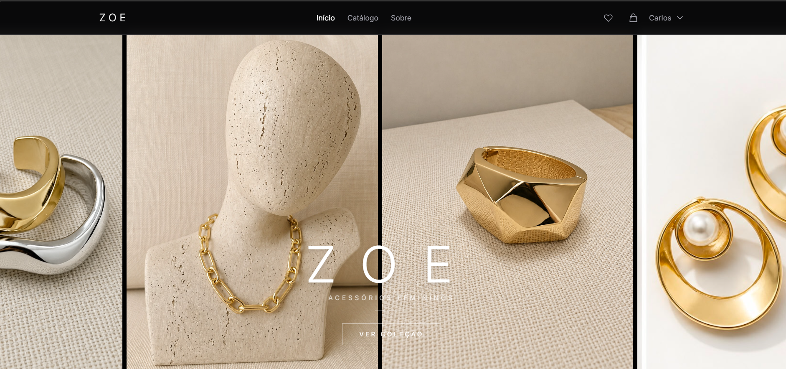
### Catálogo
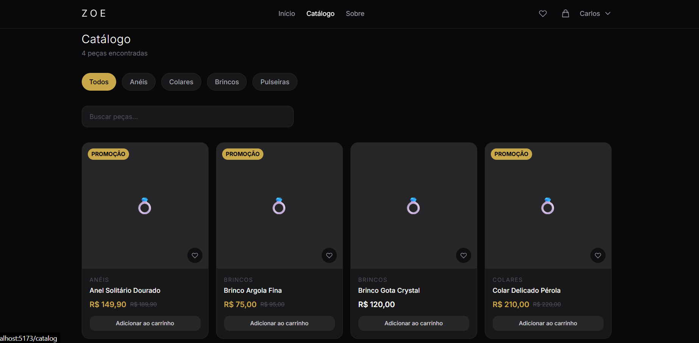
### Detalhe do Produto
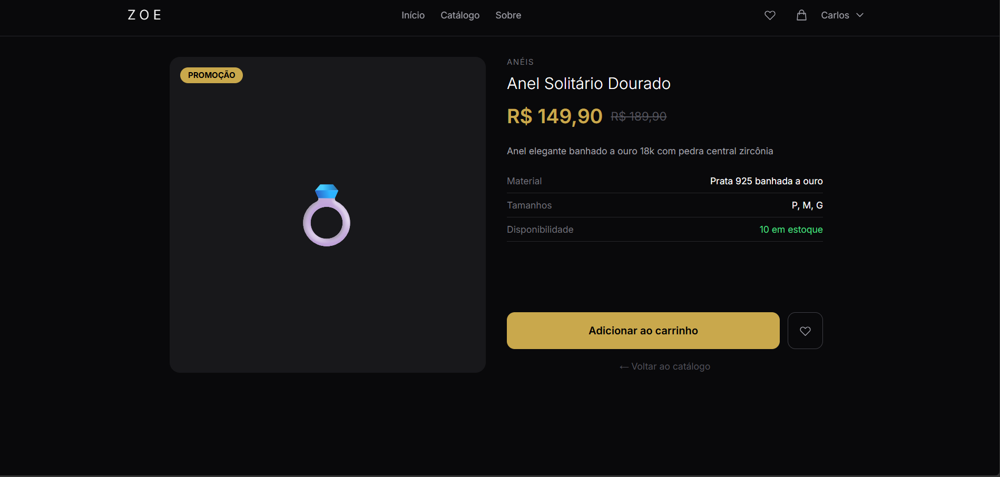
### Login
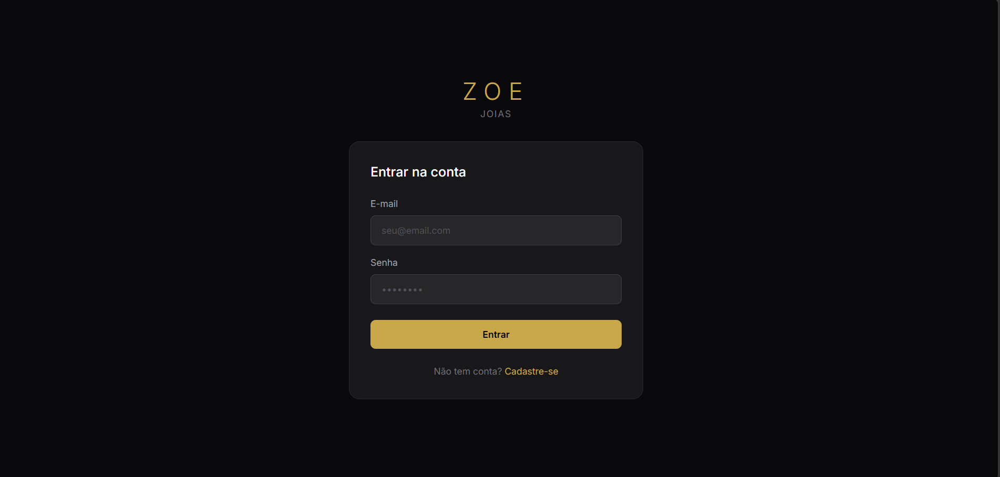
### Cadastro
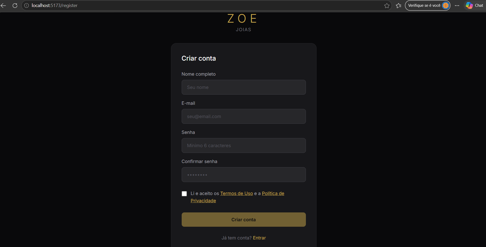
### Cadastro de Produto (Admin)
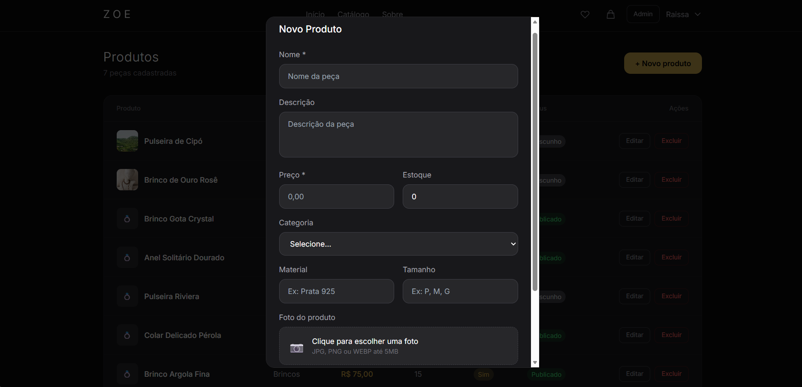
### Carrinho
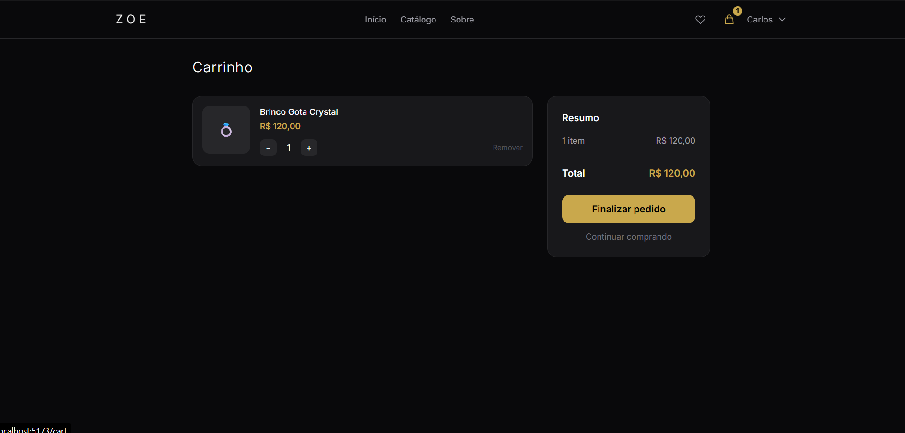
### Checkout
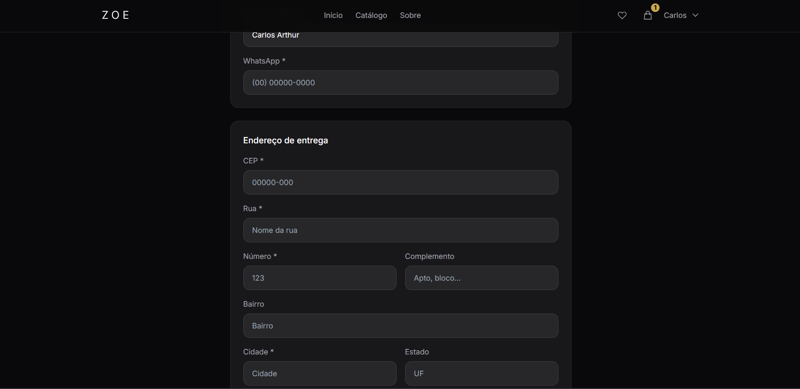
### Favoritos
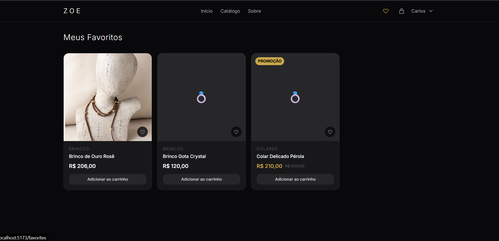
### Meus Pedidos
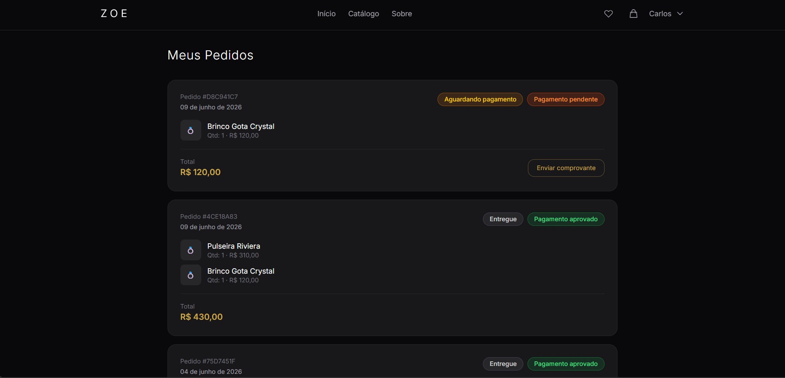
### Painel Admin — Dashboard
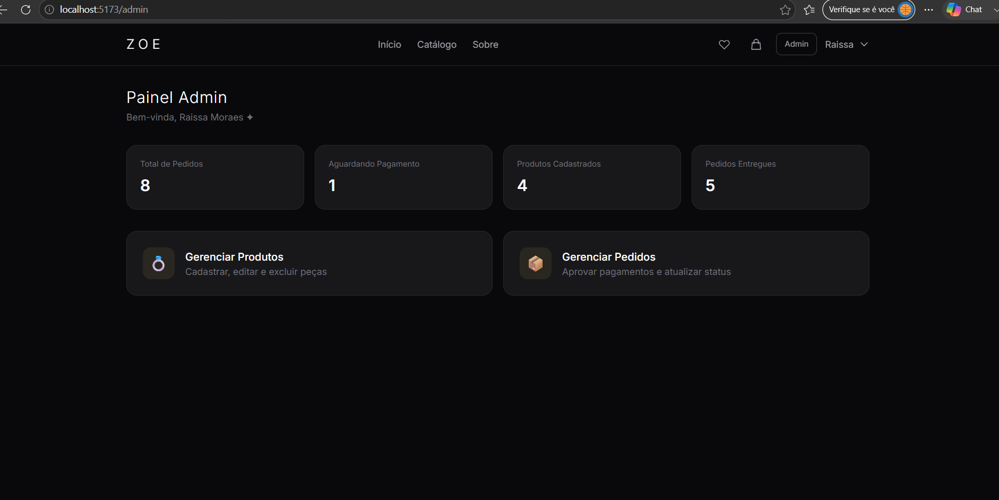
### Painel Admin — Produtos
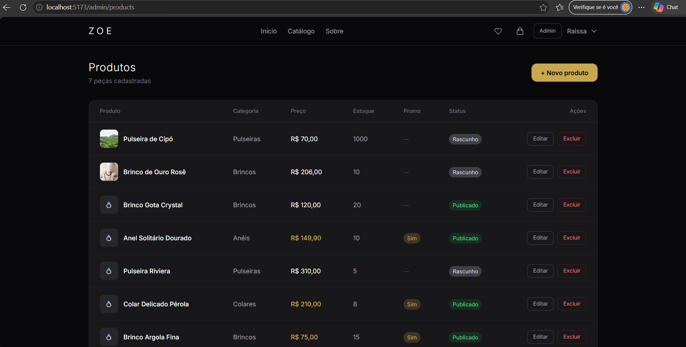
### Painel Admin — Pedidos
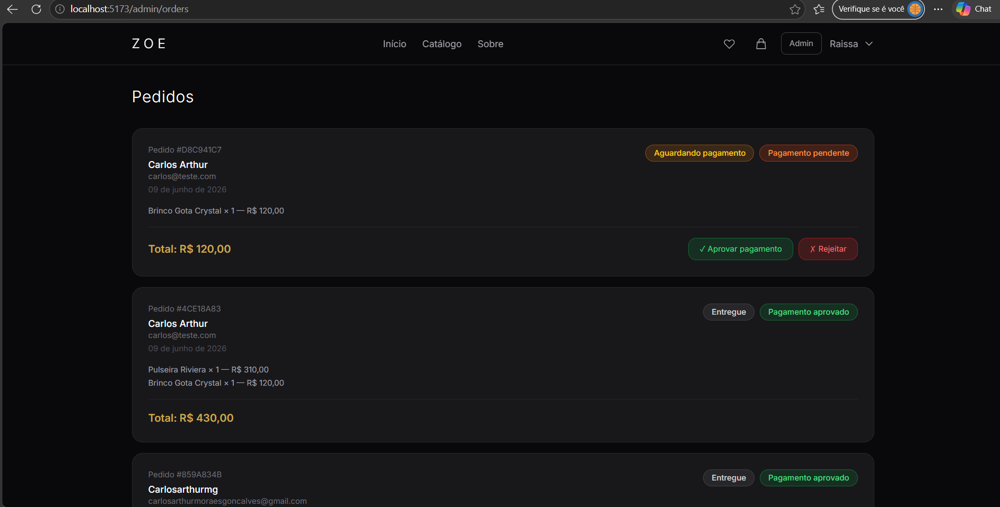
### Banco de Dados — Supabase
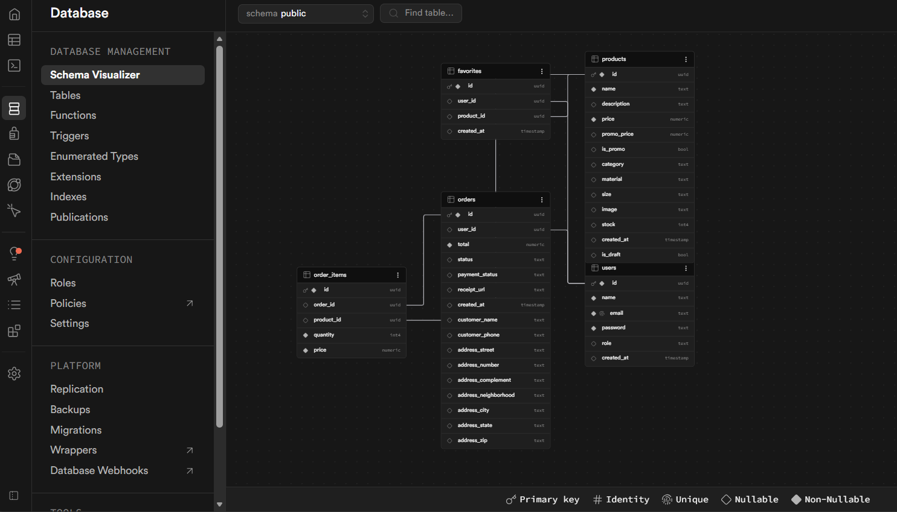

---
## Estrutura do Projeto

loja-zoe/
├── frontend_zoe/
│ └── src/
│ ├── components/
│ │ ├── Navbar.vue
│ │ └── ProductCard.vue
│ ├── views/
│ │ ├── Home.vue
│ │ ├── Catalog.vue
│ │ ├── ProductDetail.vue
│ │ ├── Login.vue
│ │ ├── Register.vue
│ │ ├── Cart.vue
│ │ ├── Checkout.vue
│ │ ├── MyOrders.vue
│ │ ├── Favorites.vue
│ │ ├── About.vue
│ │ ├── Terms.vue
│ │ ├── Privacy.vue
│ │ └── admin/
│ │ ├── Dashboard.vue
│ │ ├── Products.vue
│ │ └── Orders.vue
│ ├── stores/
│ │ ├── auth.js
│ │ ├── cart.js
│ │ └── favorites.js
│ ├── router/
│ │ └── index.js
│ └── services/
│ └── api.js
│
└── backend_zoe/
└── src/
├── controllers/
│ ├── authController.js
│ ├── productController.js
│ ├── orderController.js
│ └── favoriteController.js
├── routes/
│ ├── auth.js
│ ├── products.js
│ ├── orders.js
│ └── favorites.js
├── middleware/
│ └── auth.js
├── services/
│ └── supabase.js
└── app.js

---

## Banco de Dados

5 tabelas no Supabase (PostgreSQL):

| Tabela        | Descrição                       |
| ------------- | ------------------------------- |
| `users`       | Clientes e administradores      |
| `products`    | Catálogo de joias com estoque   |
| `favorites`   | Peças favoritadas por usuário   |
| `orders`      | Pedidos com endereço de entrega |
| `order_items` | Itens e preços de cada pedido   |

---

## Como Executar

### Pré-requisitos

- Node.js instalado
- Conta no Supabase
- Git

### 1. Clonar o repositório

```bash
git clone https://github.com/carlosarthurmg/loja-zoe.git
cd loja-zoe
```

### 2. Configurar o Back-end

```bash
cd backend_zoe
npm install
```

Crie o arquivo `.env` na raiz do `backend_zoe`:
PORT=3000
SUPABASE_URL=sua_url_do_supabase
SUPABASE_KEY=sua_chave_publica_do_supabase
JWT_SECRET=sua_chave_secreta

Inicie o servidor:

```bash
npm run dev
```

### 3. Configurar o Front-end

```bash
cd ../frontend_zoe
npm install
npm run dev
```

### 4. Acessar

- **Site:** http://localhost:5173
- **API:** http://localhost:3000

### 5. Criar usuário administrador

Após criar uma conta pelo site, execute no **SQL Editor do Supabase**:

```sql
UPDATE users SET role = 'admin' WHERE email = 'seu@email.com';
```

---

## Integrante

| Nome                           | Função                                |
| ------------------------------ | ------------------------------------- |
| Carlos Arthur Moraes Gonçalves | Desenvolvimento completo (Full Stack) |

**Cliente:** Raissa Moraes — Loja Zoe
**Instagram:** [@zoe.oficial\_\_](https://instagram.com/zoe.oficial__)

---

**Vídeo no YouTube:** [Assista ao vídeo do projeto clicando aqui](https://youtu.be/Y9GUrh2Nhzk?si=nbT4BFJTuHoYdbmv)

## Documentação

- Contrato de Prestação de Serviços (assinado)
- Documento de Requisitos
- Planejamento do Projeto

---

_Desenvolvido por [@carlosarthurmg](https://instagram.com/carlosarthurmg)_
